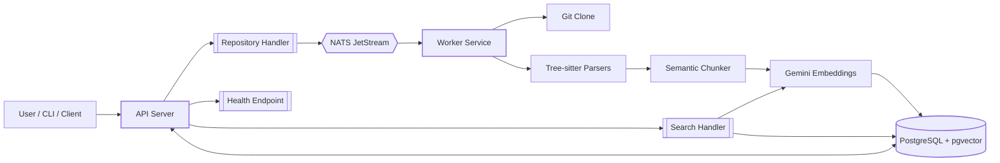
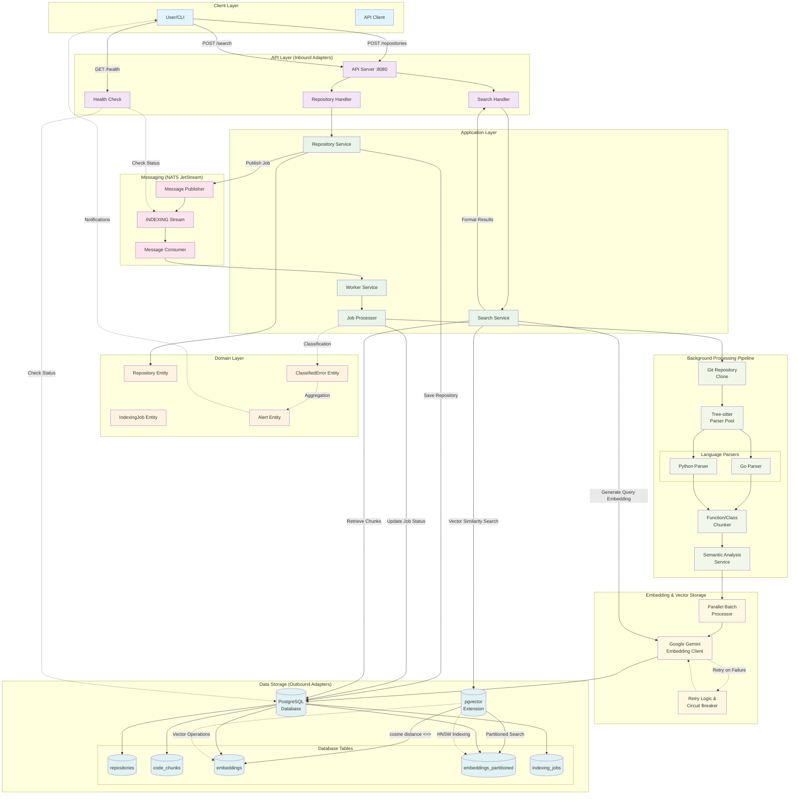
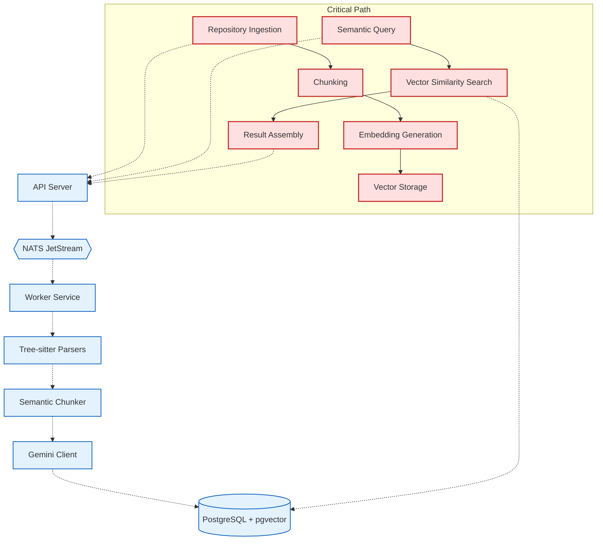

# CodeChunking

A production-grade semantic code search system using Go, PostgreSQL with pgvector, NATS JetStream, and Google Gemini. Built with hexagonal architecture and comprehensive TDD methodology.

🎉 **MVP Status: COMPLETE** - Full semantic search functionality with natural language queries!

## Features

### Core Functionality
- **Repository Indexing**: Clone and index Git repositories automatically
- **Intelligent Code Chunking**: Parse code into semantic units using tree-sitter
- **Vector Embeddings**: Generate embeddings with Google Gemini API
- **Semantic Code Search**: Natural language queries with POST /search endpoint ✨
- **Advanced Filtering**: Filter by repository, language, file type, and similarity threshold
- **Pagination & Sorting**: Full pagination with multiple sorting options (similarity, file path)
- **Asynchronous Processing**: Scalable job processing with NATS JetStream

### Production Features
- **High-Performance Messaging**: NATS JetStream client with 305,358+ msg/sec throughput
- **Advanced Health Monitoring**: 23.5µs average response time with intelligent caching
- **Circuit Breaker Patterns**: Connection resilience and fault tolerance
- **Structured Logging**: Correlation ID tracking with cross-component tracing
- **Comprehensive Security**: Input validation, XSS prevention, SQL injection protection
- **Robust Error Handling**: Centralized panic recovery and validation

### Architecture & Development
- **Hexagonal Architecture**: Clean, maintainable code structure with clear separation
- **TDD Implementation**: Using specialized red-green-refactor agent methodology
- **CLI Interface**: Cobra-based CLI with multiple commands
- **Configuration Management**: Hierarchical configuration with Viper

## Architecture

The system follows hexagonal architecture (ports and adapters) principles:

```
├── cmd/                    # CLI commands (Cobra)
├── internal/
│   ├── domain/            # Core business logic
│   ├── application/       # Use cases
│   ├── port/             # Interface definitions
│   └── adapter/          # Interface implementations
├── configs/              # Configuration files
├── migrations/           # Database migrations
└── docker/              # Docker configurations
```

### Architecture Overview



## Data Flow Architecture

The following diagram illustrates how repositories are processed, chunked, stored, and retrieved:



### Critical Components



### Key Data Flow Stages

1. **Repository Submission**: User submits repository URL via REST API
2. **Job Creation**: Repository entity created, indexing job queued to NATS JetStream
3. **Background Processing**: Worker clones repository and parses code with Tree-sitter
4. **Semantic Chunking**: Code parsed into semantic units (functions, classes, methods)
5. **Embedding Generation**: Google Gemini API generates 768-dimensional embeddings
6. **Vector Storage**: Embeddings stored in PostgreSQL with pgvector HNSW indexing
7. **Search & Retrieval**: Vector similarity search enables semantic code search

### Processing Capabilities

- **Multi-Language Support**: Go and Python parsers with extensible architecture
- **Intelligent Chunking**: Function-level, class-level, and adaptive chunking strategies
- **Fault Tolerance**: Circuit breakers, retry logic, and comprehensive error handling
- **Scalable Processing**: Parallel batch processing with configurable worker pools
- **Performance Optimization**: HNSW indexing, connection pooling, and caching

## Prerequisites

- Go 1.24 or higher
- Docker and Docker Compose
- PostgreSQL with pgvector extension
- NATS JetStream
- Google Gemini API key
- `golangci-lint` (for development)
- `migrate` CLI tool (installed via `make install-tools`)

## Quick Start

### 1. Clone the repository

```bash
git clone https://github.com/Anthony-Bible/codechunking.git
cd codechunking
```

### 2. Set up environment variables

```bash
cp .env.example .env
# Edit .env and add your Gemini API key
```

### 3. Start development environment

```bash
# Start Docker services (PostgreSQL, NATS)
make dev

# Run database migrations
make migrate-up

# Start API server
make dev-api

# In another terminal, start worker
make dev-worker
```

## Installation

### Using Go

```bash
go install github.com/Anthony-Bible/codechunking@latest
```

### Using Docker

```bash
docker pull yourusername/codechunking:latest
```

### From source

```bash
git clone https://github.com/Anthony-Bible/codechunking.git
cd codechunking
make build
```

## Usage

### CLI Commands

```bash
# Show help
codechunking --help

# Start API server
codechunking api --config configs/config.dev.yaml

# Start worker
codechunking worker --concurrency 10

# Run migrations
codechunking migrate up

# Show version
codechunking version
```

### API Endpoints

#### Index a repository
```bash
curl -X POST http://localhost:8080/api/v1/repositories \
  -H "Content-Type: application/json" \
  -d '{"url": "https://github.com/example/repo"}'
```

#### Health check with monitoring
```bash
curl http://localhost:8080/health
# Returns health status with NATS monitoring, response time metrics
```

#### Search code semantically ✨
```bash
curl -X POST http://localhost:8080/search \
  -H "Content-Type: application/json" \
  -d '{
    "query": "implement authentication middleware",
    "limit": 10,
    "similarity_threshold": 0.7,
    "languages": ["go"],
    "sort": "similarity:desc"
  }'
```

## Configuration

Configuration can be provided through:
1. Configuration files (YAML)
2. Environment variables (prefix: `CODECHUNK_`)
3. Command-line flags

Priority: Flags > Environment > Config File > Defaults

### Configuration Files

- `configs/config.yaml` - Base configuration
- `configs/config.dev.yaml` - Development overrides
- `configs/config.prod.yaml` - Production overrides

### Environment Variables

```bash
export CODECHUNK_DATABASE_USER=myuser
export CODECHUNK_DATABASE_PASSWORD=mypass
export CODECHUNK_GEMINI_API_KEY=your-api-key
export CODECHUNK_LOG_LEVEL=debug
```

## Development

### Project Structure

```
codechunking/
├── cmd/                       # CLI entry points
│   ├── codechunking/         # Main CLI
│   └── commands/             # Cobra commands
├── internal/                 # Private application code
│   ├── domain/              # Business entities
│   │   ├── entity/         # Domain entities
│   │   ├── valueobject/    # Value objects
│   │   └── service/        # Domain services
│   ├── application/         # Application layer
│   │   ├── command/        # Command handlers
│   │   ├── query/          # Query handlers
│   │   └── dto/            # Data transfer objects
│   ├── port/               # Port interfaces
│   │   ├── inbound/        # Driving ports
│   │   └── outbound/       # Driven ports
│   ├── adapter/            # Adapter implementations
│   │   ├── inbound/        # API, Worker adapters
│   │   └── outbound/       # Database, NATS, etc.
│   └── config/             # Configuration
├── pkg/                    # Public packages
├── migrations/             # Database migrations
├── configs/               # Configuration files
├── docker/                # Docker files
├── scripts/               # Utility scripts
└── tests/                 # Integration tests
```

### Running Tests

```bash
# Unit tests
make test

# Integration tests
make test-integration

# Coverage report
make test-coverage

# All tests
make test-all
```

### Linting and Formatting

```bash
# Run linter
make lint

# Format code
make fmt

# Run go vet
make vet
```

### Database Migrations

```bash
# Create new migration
make migrate-create name=add_new_table

# Apply migrations
make migrate-up

# Rollback migrations
make migrate-down
```

## Deployment

### Docker Compose (Development)

```bash
docker-compose up -d
```

This brings up PostgreSQL (with pgvector), NATS (with monitoring), the API on `localhost:8080`, and the worker.

Quick verify:

```bash
curl http://localhost:8080/health
curl -X POST http://localhost:8080/repositories \
  -H "Content-Type: application/json" \
  -d '{"url": "https://github.com/example/repo", "name": "example"}'
```

Notes:
- The app reads env via `CODECHUNK_` variables. Compose sets DB and NATS. Add `CODECHUNK_GEMINI_API_KEY` in `docker-compose.yml` if enabling embeddings/search.
- Routes are mounted at `/`, e.g. `/repositories` (no `/api/v1` prefix in current code).

### Kubernetes (Production)

```bash
kubectl apply -f k8s/
```

### Environment Variables for Production

- `CODECHUNK_DATABASE_HOST`
- `CODECHUNK_DATABASE_USER`
- `CODECHUNK_DATABASE_PASSWORD`
- `CODECHUNK_NATS_URL`
- `CODECHUNK_GEMINI_API_KEY`

## Monitoring

### Health Checks
Production-ready health monitoring with comprehensive dependency checking:

```bash
curl http://localhost:8080/health
```

Returns detailed health information including:
- **Database connectivity** with connection pool status
- **NATS JetStream** availability and performance metrics
- **Circuit breaker** status and connection stability
- **Response time tracking** with 23.5µs average response time
- **Caching layer** with 5-second TTL for performance

### Metrics and Observability
The system exposes comprehensive monitoring:

- **API Health**: `http://localhost:8080/health` (with custom headers)
- **NATS Monitoring**: `http://localhost:8222` (connection metrics)
- **Structured Logging**: JSON format with correlation IDs
- **Performance Metrics**: Request duration, throughput, error rates

## Performance

### Current Performance Metrics
- **NATS Throughput**: 305,358+ messages/second
- **Health Check Response**: 23.5µs average response time
- **Health Check Caching**: 5-second TTL with memory optimization
- **Database Connection Pooling**: Optimized for concurrent operations

### Performance Tuning

### PostgreSQL with pgvector

Optimize HNSW index parameters in migrations:
```sql
CREATE INDEX ON embeddings 
USING hnsw (embedding vector_cosine_ops)
WITH (m = 16, ef_construction = 64);
```

### Worker Concurrency

Adjust worker concurrency based on your system:
```bash
codechunking worker --concurrency 20
```

### Connection Pooling

Configure database connection pool in config:
```yaml
database:
  max_connections: 100
  max_idle_connections: 20
```

## Troubleshooting

### Common Issues

1. **pgvector extension not found**
   ```bash
   # Use the pgvector Docker image
   docker pull pgvector/pgvector:pg16
   ```

2. **NATS connection refused**
   ```bash
   # Check NATS is running
   docker-compose ps
   nats -s nats://localhost:4222 server check
   ```

3. **Migration failures**
   ```bash
   # Check database connection
   make psql
   # Manually check migration status
   SELECT * FROM schema_migrations;
   ```

4. **Health check issues**
   ```bash
   # Check NATS health with detailed diagnostics
   curl -v http://localhost:8080/health
   # Look for X-NATS-Connection-Status and X-JetStream-Enabled headers
   ```

5. **Security validation errors**
   ```bash
   # Check logs for XSS/SQL injection detection
   # Review request validation in structured logs with correlation IDs
   ```

## Contributing

1. Fork the repository
2. Create your feature branch (`git checkout -b feature/amazing-feature`)
3. Commit your changes (`git commit -m 'Add amazing feature'`)
4. Push to the branch (`git push origin feature/amazing-feature`)
5. Open a Pull Request

### Development Guidelines

- **TDD Methodology**: Use red-green-refactor cycle with specialized agents
- Follow Go best practices and idioms
- Maintain test coverage above 80% (currently 100+ passing tests across all layers)
- Update documentation for new features
- **Use conventional commit messages** (required)
- Run `make lint` and `make fmt` before committing
- Keep files under 1000 lines for readability (preferably under 500)
- Always use timeout for tests: `go test ./... -timeout 10s`

## License

This project is licensed under the MIT License - see the [LICENSE](LICENSE) file for details.

## Acknowledgments

- [tree-sitter](https://tree-sitter.github.io/) for code parsing
- [pgvector](https://github.com/pgvector/pgvector) for vector similarity search
- [NATS](https://nats.io/) for messaging
- [Google Gemini](https://ai.google.dev/) for embeddings
- [Cobra](https://github.com/spf13/cobra) for CLI
- [Viper](https://github.com/spf13/viper) for configuration

## Support

For issues and questions:
- GitHub Issues: [github.com/yourusername/codechunking/issues](https://github.com/yourusername/codechunking/issues)
- Documentation: [docs.codechunking.io](https://docs.codechunking.io)

## Documentation

For detailed documentation, see the `/docs` directory and the project wiki:

- **[Project Wiki](wiki/)**: Comprehensive configuration reference and guides
  - [Configuration Overview](wiki/configuration/Configuration.md)
  - [API Configuration](wiki/configuration/API-Configuration.md)
  - [Database Configuration](wiki/configuration/Database-Configuration.md)
  - [NATS Configuration](wiki/configuration/NATS-Configuration.md)
  - [Worker Configuration](wiki/configuration/Worker-Configuration.md)
  - [Gemini Configuration](wiki/configuration/Gemini-Configuration.md)
  - [Logging Configuration](wiki/configuration/Logging-Configuration.md)
  - [Git Configuration](wiki/configuration/Git-Configuration.md)
- **[API Documentation](docs/api.md)**: Complete REST API reference
- **[Development Guide](docs/development.md)**: Enhanced setup and development workflow
- **[Deployment Guide](docs/deployment.md)**: Production deployment and scaling

### Working with the Wiki

The wiki is included as a Git submodule. To clone the repository with the wiki:

```bash
git clone --recurse-submodules https://github.com/yourusername/codechunking.git
```

If you've already cloned the repository, initialize and update the submodule:

```bash
git submodule init
git submodule update
```

To update the wiki to the latest version:

```bash
git submodule update --remote wiki
```

## Current Status

🎉 **MVP COMPLETE** - All core phases delivered (100+ passing tests):
- ✅ **Phase 2**: Production-ready API with repository management
- ✅ **Phase 3**: Asynchronous processing with NATS JetStream
- ✅ **Phase 4**: Intelligent code chunking with tree-sitter
- ✅ **Phase 5**: Vector embeddings with Google Gemini
- ✅ **Phase 6**: Vector storage and retrieval with pgvector
- ✅ **Phase 7.1**: **Semantic search API** with natural language queries ✨

**Key MVP Features Delivered:**
- Complete semantic code search with POST /search endpoint
- Advanced filtering (repository, language, file type, similarity threshold)
- Pagination and sorting capabilities
- Comprehensive TDD implementation with 50+ passing tests
- Production-ready error handling and validation
- Full OpenAPI documentation

## Post-MVP Roadmap

- [ ] Support for more programming languages (Python, JavaScript, etc.)
- [ ] Incremental repository updates and webhooks
- [ ] Web UI for search interface
- [ ] GitHub/GitLab webhooks for auto-indexing
- [ ] Multi-model embedding support
- [ ] Distributed worker scaling
- [ ] Query result caching and performance optimization
- [ ] Fine-tuned ranking algorithms and hybrid search
